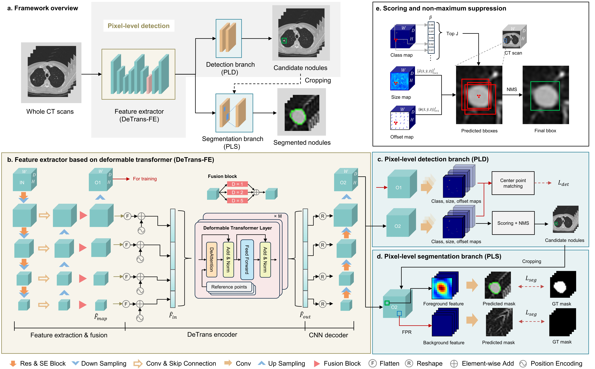

## Small but Strong: Lightweight Architecture Improves Lung Nodule Detection and Segmentation

This repository contains a reference implementation of the algorithms described in our paper.

### Introduction

---

Lung nodule detection and segmentation from the thorax computed tomography (CT) scans are fundamental prerequisites for lung cancer diagnosis and therapy. Inspired by the substantial progress of neural networks in 2D natural images, existing methods extend 2D networks to their 3D counterparts to fulfill lung nodule detection and segmentation with massive network parameters. However, they neglect the huge difference in the amount of available training data between lung nodule CT scans and natural images (∼2k vs. >10b), making these heavyweight networks face the risk of overfitting and inferior performance. In this study, we propose a lightweight architecture for automatic lung nodule detection and segmentation, alleviating the overfitting caused by the data insufficiency issue. To reduce the network parameters of the backbone network, the deformable Transformer is introduced to re- tain large receptive fields for desired performance with a small model size. To eliminate extensive anchor-related parameters, we employ the anchor-free structure for the detection task, which also aligns the common features with the segmentation task. Benefiting from this, a much higher level of parameter sharing becomes possible between two tasks, further reducing the entire model size and imposing a strong regularizer to alleviate the overfitting. The proposed method is validated on the LUNA16 and LIDC- IDRI datasets, and experimental results demonstrate that our method outperforms the state-of-the-art lung nodule detection and segmentation methods with a small model size. 





### Dataset

---

- [LUNA16](https://luna16.grand-challenge.org/)
- [LIDC_IDRI](https://www.cancerimagingarchive.net/nbia-search/?CollectionCriteria=LIDC-IDRI)

### Data Preprocessing

---

We provide detailed data preprocessing pipelines for both LUNA16 and LIDC-IDRI datasets. Please refer to the `dataprocessing/README.md` for comprehensive instructions.

### Prerequisite

---

- Python 3.8

- PyTorch 1.10.0, torchvision 0.11.1

- CUDA 11.3

- SimpleITK, scipy, scikit-image, pandas, numpy

- For common packages, simply run:

  ```python
  pip install -r requirements.txt
  ```

  The packages listed here may not be complete. if you run into missing packages, you may want to google and install them.

### Usage

---

- Configuration

​	Before training or testing, configure your data paths and model parameters in `config_training.py`:

- Training

  To train the model from scratch:	

  ```python
  python train.py --save_dir /path/to/save/models --batch_size 4 --workers 8
  ```

- Testing / Inference

  ```python
  python test.py --resume /path/to/model_checkpoint.ckpt --test_save_dir /path/to/save/results --batch_size 1
  ```

- Pretrained Models

  We provide pretrained models `model_checkpoint.ckpt` for direct use, which can be download from [google drive](https://drive.google.com/file/d/1XoeFYGGuUqNFil-R0rPT3H0F25y3Aj2J/view?usp=drive_link).

  

### Acknowledgements

---

We thank the LUNA16 and LIDC-IDRI dataset providers for making their data publicly available.

### Statement

---

This project was only designed for academic research.
