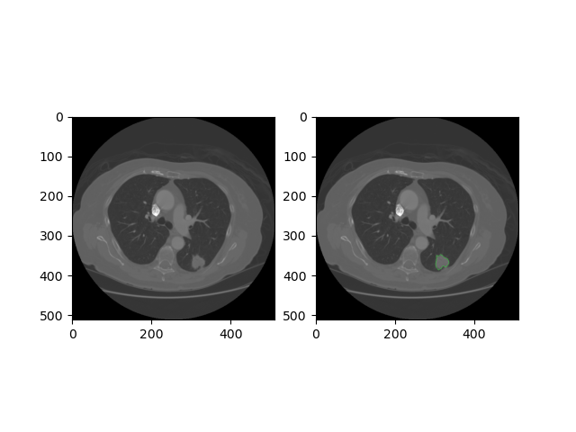
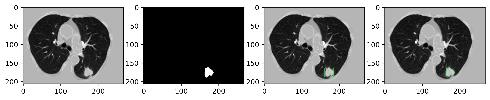

## Lung Nodule Data Preprocessing

This document describes the preprocessing pipelines for the LUNA16 and LIDC-IDRI datasets, which are widely used for lung nodule detection and analysis.






### Dataset

---

- [LUNA16](https://luna16.grand-challenge.org/)

- [LIDC-IDRI](https://www.cancerimagingarchive.net/nbia-search/?CollectionCriteria=LIDC-IDRI)

  

### Table of Contents

---

- LUNA16 Data Preprocessing

  - Data Loading

  - Lung Segmentation Processing

  - Image Processing and Enhancement

  - Image Resampling

  - CT Cropping and Nodule Annotation Conversion

  - Output Files

- LIDC-IDRI Data Preprocessing

  - Environment Configuration

  - Data Loading

  - Nodule Processing and Feature Extraction

  - Data Storage

- Usage


### 1. LUNA16 Data Preprocessing

---

The LUNA16 preprocessing pipeline (`prepare_luna16.py` and `config_training.py`) transforms raw CT scans into standardized volumes suitable for deep learning models.

##### Data Loading (`load_itk_image(filename)` function)

- Load `.mhd` format CT images using SimpleITK

- Extract image metadata including origin coordinates, voxel spacing, and transformation matrix
- Check image orientation and apply flipping if necessary to ensure correct anatomical orientation	

##### Lung Segmentation Processing (`process_mask(mask)` function)

- Extract the left lung (marked as 3) and right lung (marked as 4) regions from the segmentation mask
- Apply convex hull algorithm to create smoother lung boundaries
- Use morphological dilation to expand the lung mask, ensuring inclusion of nodules attached to lung walls

##### Image Processing and Enhancement (`lum_trans(img)` function)

- Apply windowing transformation to map HU values from the lung window range (-1200HU to 600HU) to 0-255
- Set non-lung regions to a uniform value (170) to create consistent background
- Identify and process bone tissue by replacing values above 210 (bone tissue) with 170 to avoid high-density interference

##### Image Resampling (`resample(img, spacing, new_spacing=[1, 1, 1])` function)

- Resample different resolution CT images to a uniform voxel size (1mm×1mm×1mm)
- Calculate appropriate scaling factors based on original spacing
- Use interpolation to generate the resampled volume

##### CT Cropping and Nodule Annotation Conversion (`crop_and_convert_annotations(img, mask, origin, spacing, annotations)` function)

- Calculate the minimum bounding box for the lung mask with added margin (margin=5)
- Crop the preprocessed image to the bounding box dimensions
- Convert nodule annotations from world coordinates to voxel coordinates
- Adjust nodule size (diameter) to account for resampling
- Adjust nodule positions relative to the cropped image (z, y, x, d)

##### Output Files (LUNA16)

For each CT scan, the following files are generated:

- `{name}_clean.npy`: Preprocessed CT volume data
- `{name}_spacing.npy`: Original voxel spacing
- `{name}_extendbox.npy`: Cropping bounding box
- `{name}_origin.npy`: Original coordinate origin
- `{name}_mask.npy`: Lung mask
- `{name}_label.npy`: Nodule annotation information (position and diameter)


### 2. LIDC-IDRI Data Preprocessing

-----------

The LIDC-IDRI preprocessing pipeline (`prepare_lidc-idri.py` and `config_file_create.py`) processes the LIDC-IDRI dataset, which includes expert annotations from multiple radiologists.

##### Environment Configuration

- The `config_file_create.py` script generates a configuration file (`lung.conf`) that manages parameters and path settings: Data directory paths、Mask threshold、Confidence level、Padding size

##### LIDC Data Loading (`load_lidc_data()` function)

- Use the `pylidc` library to load DICOM files from the LIDC-IDRI dataset
- Extract key metadata: patient_id, study_instance_uid, series_instance_uid, etc.

##### Nodule Processing and Feature Extraction (`process_nodules(scan)` function)

- Extract nodule annotations from multiple expert radiologists

  - LUNA16 nodule selection criteria: nodules annotated by at least 3 radiologists and CT slice thickness ≤ 2.5mm

- Calculate multiple nodule features:

  - Morphological features: sphericity, lobulation, spiculation
  - Internal structure features: internalStructure, calcification, texture
  - Edge features: margin, subtlety
  - Malignancy grade: malignancy

- Use the `median_high` function to determine the median value for features annotated by multiple radiologists

  - Malignancy > 3 is labeled as malignant
  - Malignancy < 3 is labeled as benign
  - Malignancy = 3 is labeled as ambiguous

- Generate nodule masks using the `consensus` function based on multiple expert annotations

  - Mask selection criteria: effective nodules that have been screened and whose mask voxel regions have been outlined by at least two experts.

##### Data Storage (`save_nodule_data` function)

- The following information is stored in `newnodule.csv`:
  - Patient ID and scan information: patient_id, series_instance_uid, study_instance_uid
  - Nodule annotation information: x_loc, y_loc, slice_c, diameter
  - Nodule features: subtlety, internalStructure, calcification, sphericity, margin, lobulation, spiculation, texture, malignancy, is_cancer


#### 3. Usage

------

Run the preprocessing scripts as follows:

```python
# For LUNA16 preprocessing
python prepare_luna16.py

# For LIDC-IDRI configuration generation
python config_file_create.py

# For LIDC-IDRI preprocessing
python prepare_lidc-idri.py
```


### Reference

-----

- LUNA16 Data Preprocessing: [LUNA16-Lung-Nodule-Analysis-2016-Challenge](https://github.com/junqiangchen/LUNA16-Lung-Nodule-Analysis-2016-Challenge)
- LIDC-IDRI Data Preprocessing: [LIDC-IDRI-Preprocessing](https://github.com/jaeho3690/LIDC-IDRI-Preprocessing)
